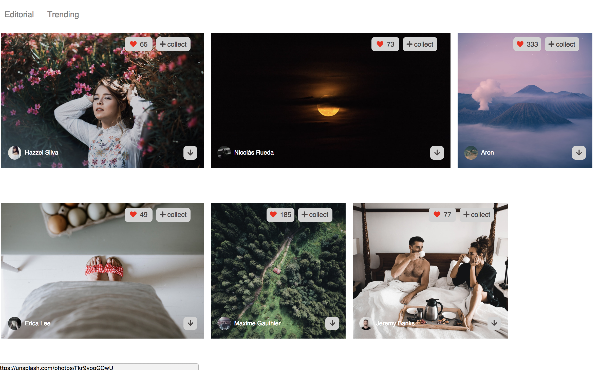

# Unsplash Project

This is a simple Unsplash project. 

# App Functions 
The project has two pages, HomePage and SearchPage.

1. Homepage

- shows a navigation bar on the top. 
- shows a searching box at the header. 
- displays a board of photos by Editorial and Trending. 
- Each photo contains buttons which show about the photo's likes, user's info and photo download link.

Users will be able to 

- search photos by key words and click on 'Enter' to navigate to the Searchpage.
- switch the views of photos by clicking on the tabs. (Editorial and Trending)
- click on buttons on each photo to check the info.

2. Searchpage 

- shows a navigation bar, including a searching box on the top. 
- shows the title of search result
- displays the search results on the photo board

Users will be able to 
- search photos by key words and click on 'Enter' to get results
- navigate back to the Homepage by clicking on Unsplash or camera image.

# App Screenshots 

Homepage

Photo view

Searchpage

## Instructions for installment

* clone my repo `https://github.com/mavisluan/unsplash`
* install all project dependencies with `npm install`
* Update API key: 
- Apply unsplash API key 
- open 'src/API.js' and replace 'YOUR_ACCESS_KEY' with your own unplash API key. 
* start the development server with `npm start`

