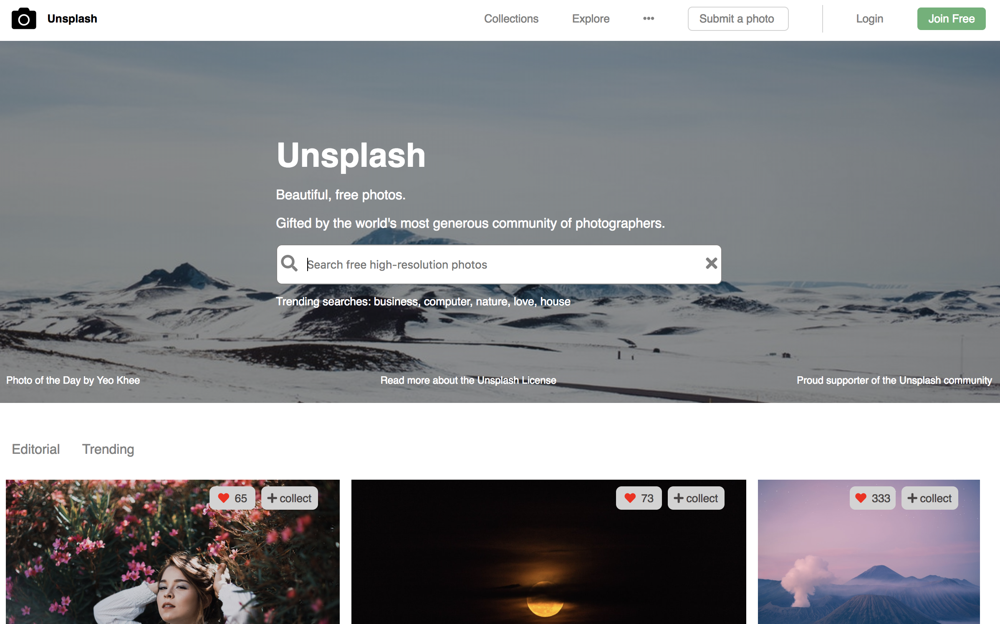
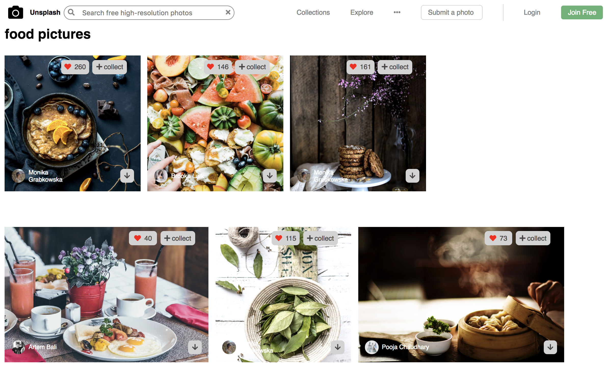

# Unsplash Project

This is a simple Unsplash project, built with ReactJS. 

# App Functionalty
The project has two pages, HomePage and SearchPage.

Users will be able to 
- navigate between two pages
- check photos and each photo's information
- search photos by key words 

# App Screenshots 

## Homepage

## Searchpage

## Installation Instructions

- git clone https://github.com/mavisluan/unsplash
- cd unsplash
- yarn install
- Update API key: 
1) Apply unsplash API key 
2) open 'src/API.js' and replace 'YOUR_ACCESS_KEY' with your own unplash API key. 
- yarn start

